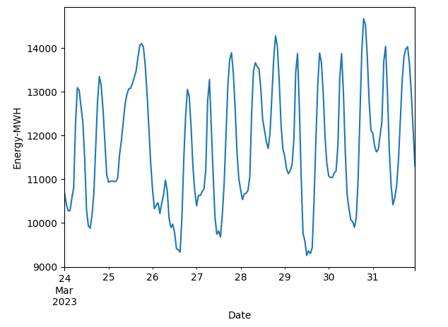
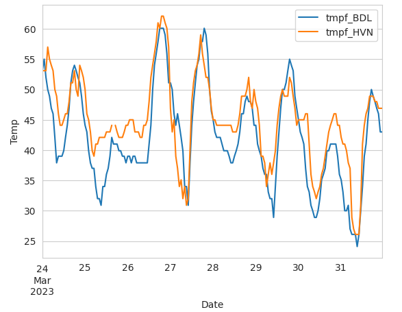
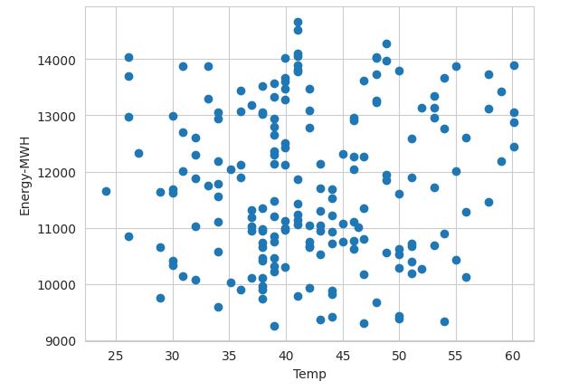
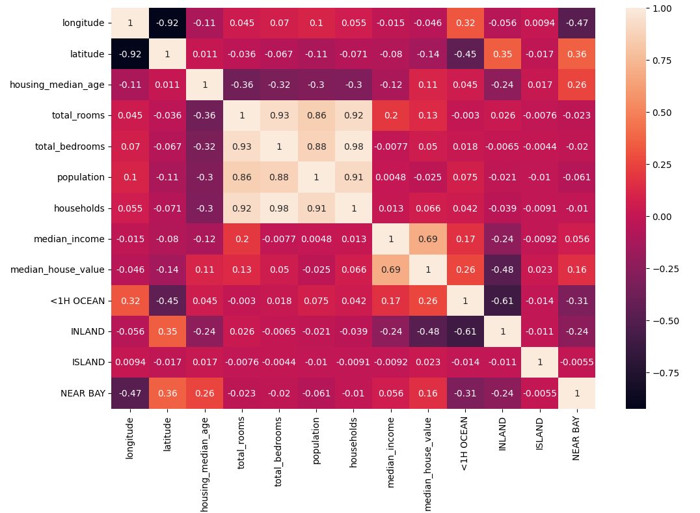
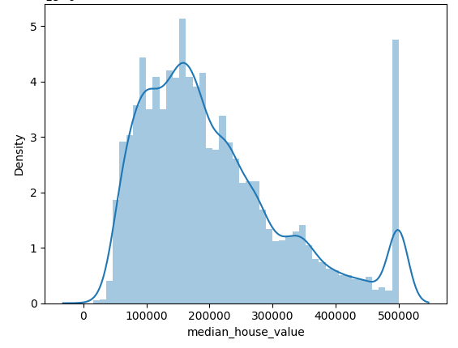

# Jainav Shah
# Data Anlayst | Data Science | UCONN MS BAPM | The Hartford | Intuit 

# [Project 1: Weather / Energy Analysis](https://github.com/jainavshah/DataSciencePortfolio/blob/main/Weather_and_Energy.ipynb)

I wanted to investigate if there was a correlation between weather and energy use, therefore I collected meteorological and energy data for CT for a period of one week at the end of March 2023.

* obtain energy data and convert it on an hourly basis to draw insights for a week's worth of energy consumption.
* download weather information for several air stations in Connecticut
1. prepare the weather data so that you may concentrate on just a few columns
2. eliminate the missing value
3. change to numerical columns
4. date-time indexed.
5. Resample data gathered at 5-minute intervals to 60-minute intervals.
* compare the temperature trends across 2 or more stations to see if they are similar or different for the past week.
* Combine weather and energy data and use a scatter plot to examine their relationships.

Energy                     |  Temprature               | Scatter Plot
:-------------------------:|:-------------------------:|:-------------------------:
  |   | 

# [Project 2: California Housing Prediction](https://github.com/jainavshah/DataSciencePortfolio/blob/main/CaliHousingPrediction.ipynb)

I want to forecast the median house value in California based on many features. I believed that since the median house value is continuous, a regression model might be used to predict it.

1. Kaggle is the source of the data
2. Recognize the transition from categorical to continuous variables.
3. Using correlation analysis to pinpoint crucial variables
4. Data splitting and min/max scalability
5. Linear modeling

Correlation Analysis       |  Median Value Histogram               
:-------------------------:|:-------------------------:
  |   

